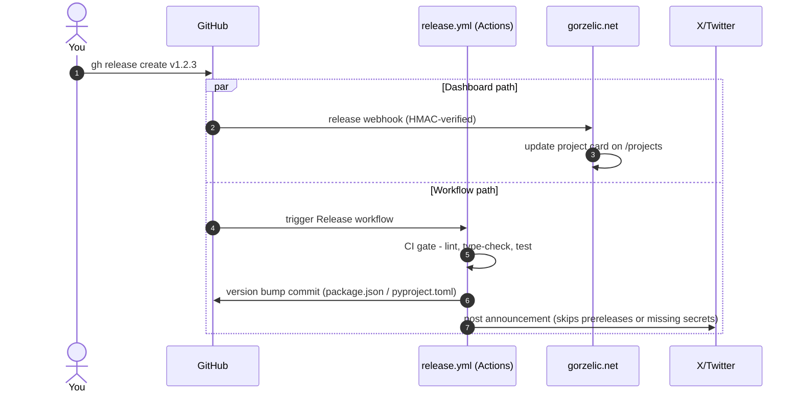

# release-kit

**Create a GitHub Release on any connected repo and this kit runs the CI gate, bumps the version, updates the project card on [gorzelic.net/projects](https://gorzelic.net/projects), and posts the announcement to X.**

[](workflows/)
[](LICENSE)

## How It Works

Two independent paths fire on every release. The webhook keeps the dashboard current even if CI fails; the workflow gates the version bump and the announcement on CI passing.



Pushes flow through the same webhook: `push` events update the card's last commit, author, and activity timestamp, so the dashboard stays live between releases.

## What is release-kit

Reusable release automation for the gorzelic.net ecosystem. It is two small pieces: a set of copy-in GitHub Actions workflow templates (one per stack) and a webhook receiver on gorzelic.net that renders each repo as a live project card. Connecting a repo means copying one workflow file and registering one webhook — after that, `gh release create` is the only release command you run.

Platform announcements are **opt-in per repo**: each one is an independent workflow job that skips gracefully when its secrets aren't configured. Commented job stubs in the templates mark where the next platforms plug in.

## Workflow Templates

Pick the template for your stack; each differs only in its CI gate and version-bump strategy.

| Stack | Template | CI gate | Version bump |
|-------|----------|---------|--------------|
| Node.js / TypeScript | [`release-node.yml`](workflows/release-node.yml) | eslint + tsc + tests | `package.json` + lockfile |
| Python | [`release-python.yml`](workflows/release-python.yml) | ruff + mypy + pytest | `pyproject.toml` (or `setup.cfg` / `__version__`) |
| Go | [`release-go.yml`](workflows/release-go.yml) | golangci-lint + `go test -race` + `go vet` | none — Go modules version by git tag |
| Terraform / IaC | [`release-terraform.yml`](workflows/release-terraform.yml) | `terraform fmt` + `validate` (tflint step included, commented) | none — versioned by the release tag |
| Any | [`release-minimal.yml`](workflows/release-minimal.yml) | none | none — announce only |

All templates validate the tag as strict semver (`vX.Y.Z`) before touching version files, and post to X only for non-prerelease releases.

## Quick Start

Prerequisites: `gh`, `jq`, `curl`, plus `ADMIN_SECRET` and `GITHUB_WEBHOOK_SECRET` in your environment.

### 1. Register the project and webhook

```bash
./scripts/onboard-project.sh
```

The script prompts for slug, name, description, and tech tags, registers the project against the gorzelic.net API, and creates the GitHub webhook (`push` + `release` events). To do the same by hand, see [docs/ONBOARDING.md](docs/ONBOARDING.md).

### 2. Copy a workflow template

```bash
mkdir -p .github/workflows
cp workflows/release-node.yml .github/workflows/release.yml
```

Edit the `# <<< CUSTOMIZE` markers for your project (lint command, test command, version file).

### 3. Set secrets

Skip this if Twitter secrets are already set at the org level. Otherwise:

```bash
./scripts/setup-secrets.sh --repo bgorzelic/my-project   # or --org bgorzelic
```

### 4. Release

```bash
gh release create v1.0.0 --title "v1.0.0" --notes "First release"
```

The workflow verifies CI, bumps the version, and posts to X; the webhook updates the project card.

## Secrets Reference

| Secret | Required | Scope | Purpose |
|--------|----------|-------|---------|
| `ADMIN_SECRET` | For onboarding | Local/CI | gorzelic.net API auth |
| `GITHUB_WEBHOOK_SECRET` | Yes | Org or repo | Webhook HMAC verification |
| `TWITTER_API_KEY` | For X posts | Org or repo | OAuth 1.0a consumer key |
| `TWITTER_API_SECRET` | For X posts | Org or repo | OAuth 1.0a consumer secret |
| `TWITTER_ACCESS_TOKEN` | For X posts | Org or repo | OAuth 1.0a access token |
| `TWITTER_ACCESS_SECRET` | For X posts | Org or repo | OAuth 1.0a access secret |

> **Recommendation**: set the Twitter secrets as GitHub **organization secrets** so every repo inherits them.

## Documentation

| Document | Description |
|----------|-------------|
| [docs/ONBOARDING.md](docs/ONBOARDING.md) | Full step-by-step onboarding guide |
| [docs/ARCHITECTURE.md](docs/ARCHITECTURE.md) | How the system works end-to-end |
| [docs/CUSTOMIZATION.md](docs/CUSTOMIZATION.md) | Adapting workflows for your stack |
| [docs/SOCIAL_PLATFORMS.md](docs/SOCIAL_PLATFORMS.md) | Social media integration guide and roadmap |
| [docs/API_REFERENCE.md](docs/API_REFERENCE.md) | gorzelic.net internal API reference |
| [docs/TROUBLESHOOTING.md](docs/TROUBLESHOOTING.md) | Common issues and solutions |

## Social Media Roadmap

- [x] **X/Twitter** — OAuth 1.0a, posts on non-prerelease releases
- [ ] **LinkedIn** — OAuth 2.0, company page posts (commented job stub in templates)
- [ ] **Bluesky** — AT Protocol, personal feed posts (commented job stub in templates)
- [ ] **Discord** — webhook, channel announcements
- [ ] **Mastodon** — OAuth 2.0, status posts

Each platform lands as an independent workflow job that skips when its secrets are absent.

## License

[MIT](LICENSE)
